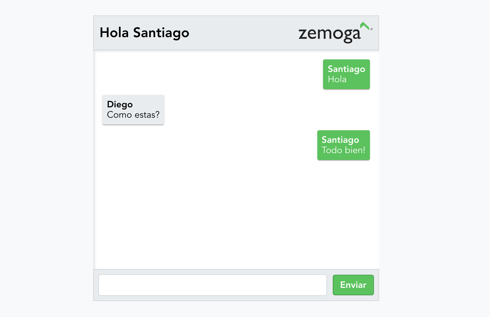

# Descripción de la aplicación

[capitulo anterior](README.md) <----> [capitulo siguiente](Chapter_02.md) | [inicio](README.md)

Vamos a estar desarrollando un pequeño chat en tiempo real haciendo uso de [GraphQl](https://graphql.org) junto con [ApolloClient](https://www.apollographql.com/docs/react/) y adicionalmente usaremos [ReactJS](https://es.reactjs.org) para la implementación del UI.

Es resultado final de nuestra aplicación será parecido a esto:

Después de esto, cada persona tendrá la posibilidad de agregar funcionalidades extras, tales como autenticación, timestamps o incluso modificar los estilos para que luzca de una forma diferente.

## Requerimientos de la aplicación

1. Múltiples usuarios.
2. Una pantalla que me permita ingresar a la aplicación colocando un apodo/nombre.
3. Un lugar donde pueda ver la lista de mensajes.
4. Un campo de texto que me permita ingresar nuevos mensajes.
5. Actualización de la lista de mensajes en tiempo real.

## Como poder avanzar en el taller

pendiente...

[capitulo anterior](README.md) <----> [capitulo siguiente](Chapter_02.md) | [inicio](README.md)
