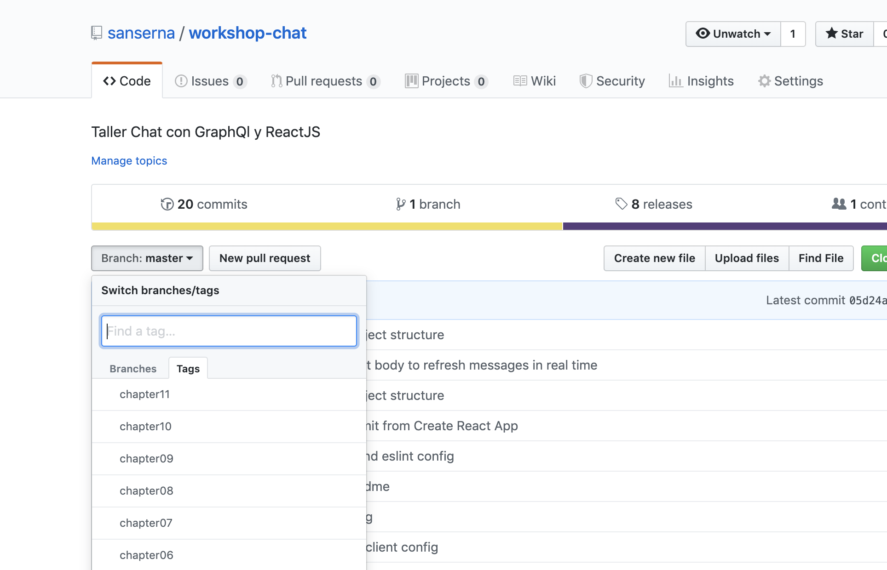

# Descripción de la aplicación

[capítulo siguiente](Chapter_02.md) | [inicio](README.md)

Vamos a estar desarrollando un pequeño chat en tiempo real haciendo uso de [GraphQl](https://graphql.org) junto con [ApolloClient](https://www.apollographql.com/docs/react/) y adicionalmente usaremos [ReactJS](https://es.reactjs.org) para la implementación del UI.

Es resultado final de nuestra aplicación será parecido a esto:


Después de esto, cada persona tendrá la posibilidad de agregar funcionalidades extras, tales como autenticación, timestamps o incluso modificar los estilos para que luzca de una forma diferente.

## Requerimientos de la aplicación

1. Múltiples usuarios.
2. Una pantalla que me permita ingresar a la aplicación colocando un apodo/nombre.
3. Un lugar donde pueda ver la lista de mensajes.
4. Un campo de texto que me permita ingresar nuevos mensajes.
5. Actualización de la lista de mensajes en tiempo real.

## Como poder avanzar en el taller

A medida que vamos avanzando capitulo a capitulo, iremos realizando modificaciones sobre el código, para poder mantenerse alineado con lo que debería tener la aplicación, se tienen las siguientes opciones:

### Opción 1: revisar el repositorio de Github

1. Ir al [repositorio](https://github.com/sanserna/workshop-chat) del taller.
2. Seleccionar el capitulo correspondiente en la lista de tags que se encuentra dentro del selector de ramas.



3. Explorar los archivos y revisar el código.

### Opcion 2: hacer un checkout del codigo en el tag de cada capitulo

1. Clonar el [repositorio](https://github.com/sanserna/workshop-chat) del taller.

```bash
git clone https://github.com/sanserna/workshop-chat.git
```

2. Cargar todos los tags de forma local.

```bash
git fetch --all --tags
```

3. Hacer un checkout del tag correspondiente al capitulo.

```bash
git checkout chapter_name
```

4. Revisar el código.

[capítulo siguiente](Chapter_02.md) | [inicio](README.md)
